# Recipe Rating Prediction: A Data Science Analysis

## Introduction
This analysis investigates recipe data from Food.com to understand and predict recipe ratings. The dataset contains 83,782 recipes with information about cooking time, ingredients, steps, and nutritional content. Our main question focuses on predicting recipe ratings based on recipe characteristics. This project is valuable because it aims to predict the quality of new recipes based on minimal ratings from users. 

The dataset consists of two separate sources:

- Recipes Dataset: Contains detailed information about each recipe, including its ingredients, cooking time, and nutritional information.
- Ratings Dataset: Includes user ratings and reviews for the recipes listed in the Recipes dataset.
Initially, these datasets were separate, so the first step was to merge them using the recipe_id field from the ratings dataset and the id field from the recipes dataset. 

After merging, we calculated the average rating per recipe: This was done by grouping the ratings by recipe ID and computing the mean. We then added this average rating back to the recipes dataset.

Relevant columns in our dataset:
- `minutes`: Time required to cook the recipe
- `n_steps`: Number of steps in the preparation
- `n_ingredients`: Number of ingredients used
- `nutritional values`: Including calories, fat, sugar, sodium, protein
- `avg_rating`: The target variable (scale of 1-5)

## Data Cleaning and Exploratory Data Analysis

### Data Cleaning Process

During the initial examination of the dataset, several data quality issues were identified that required cleaning:

1. **Cooking time outliers**: Some recipes had cooking times listed as excessively high (over 1 million minutes), which were clearly erroneous.
- Cooking times were examined for outliers using the **Interquartile Range (IQR)** method. The 25th and 75th percentiles of cooking time were calculated (`Q1` and `Q3`), and any recipe with a cooking time above the **upper bound** (Q3 + 1.5 * IQR) was considered an outlier and removed from the dataset.
   - This step helped to ensure that the cooking time values were within a reasonable range, preventing erroneous data from skewing subsequent analysis, such as modeling or predictions.

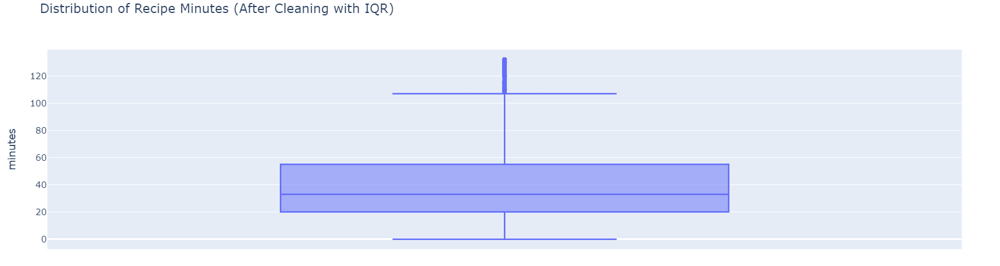
2. **Zero Rating**: Some ratings were zero which were changes to np.nan

2. **Column Selection**: Multiple columns had no use in the prediction and data analysis process. These were dropped

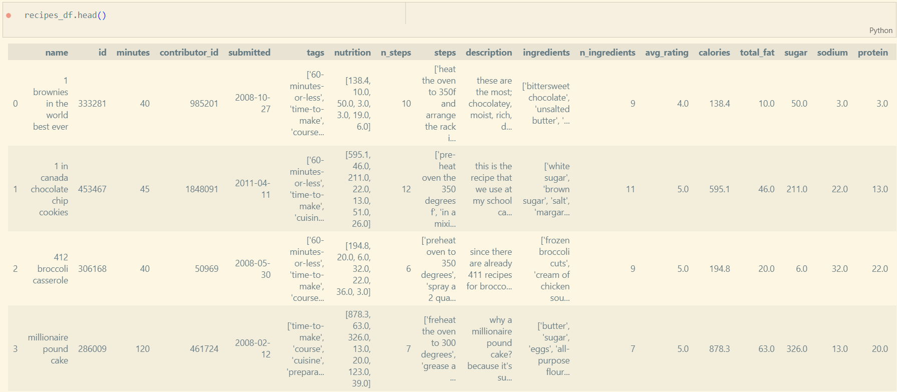

### Univariate Analysis
The distribution of cooking times revealed important patterns:
- Most recipes require between 15-45 minutes
- Median cooking time is 30 minutes
- Distribution is right-skewed, with some recipes taking several hours

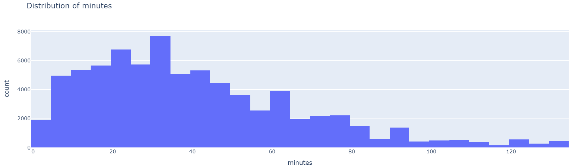
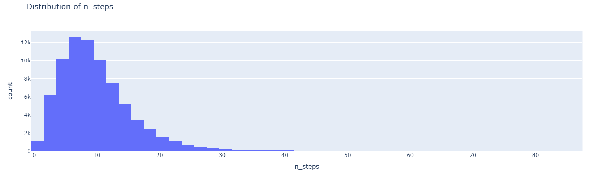
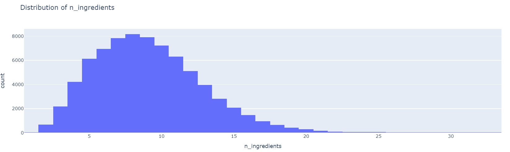

### Bivariate Analysis
When examining the relationship between cooking time and ratings:
- No clear correlation between cooking duration and rating
- Similar rating distributions across different cooking times
- High ratings (4-5 stars) dominate across all time ranges

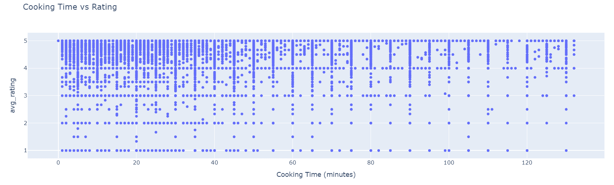
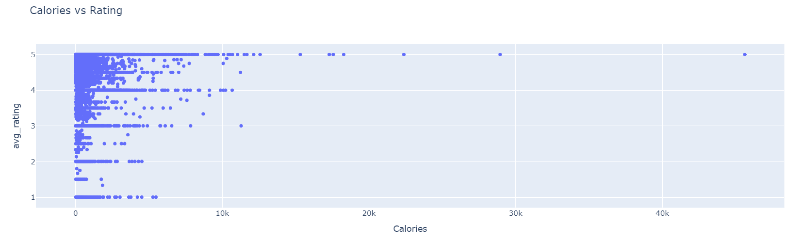

### Interesting Aggregates
Analyzing ratings across different recipe characteristics:
- Average ratings by cooking duration quartiles

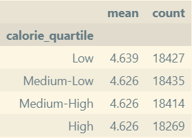

## Assessment of Missingness

Our analysis of missing values revealed:
1. NMAR Analysis:
   - Based on the missingness of ratings in the dataset, it’s possible that the rating column is NMAR. This could be because users are less likely to rate recipes they haven’t made. Therefore, the missingness of data in this column is not random. If we had additional data on user behavior, such as whether they interacted with recipes but didn't rate them, we could potentially explain this missingness as Missing At Random (MAR). Without such data, it’s difficult to definitively classify the missingness as MAR. Thus, based on the reasoning above, we conclude that the missingness in the rating column may be NMAR.

2. Missingness Dependency:
   - After performing the permutation tests, we found that the missingness of the rating column depends significantly on n_steps (p-value < 0.05), meaning that recipes with longer cooking times tend to have missing ratings.
   - In contrast, the missingness of rating did not depend on minutes (p-value > 0.05), indicating that the missingness is not related to the time taken to make the food.
   

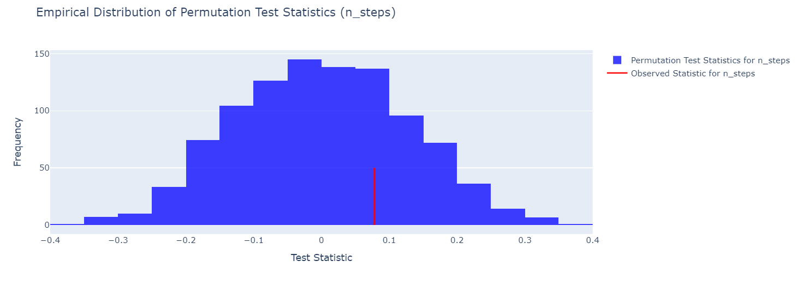
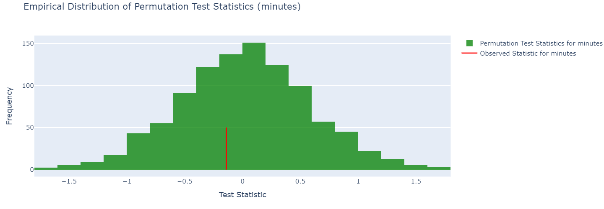

## Hypothesis Testing
We tested whether cooking time influences recipe ratings.

Null Hypothesis (H0): No significant difference in average ratings between long and short cooking time recipes.
Alternative Hypothesis (H1): There is a significant difference in ratings between these groups.
Test Statistic: The difference in average ratings between recipes with long and short cooking times.
Significance Level: 0.05 

Results:
- Observed difference: 0.0012
- P-value: 0.9310

Conclusion: Since the p-value (0.9310) is much greater than the significance level of 0.05, we fail to reject the null hypothesis. This suggests there is no significant difference in average ratings between long and short cooking time recipes.

Justification: The test statistic (difference in ratings) and p-value were appropriate for testing whether cooking time influences recipe ratings. A high p-value indicates that any observed difference is likely due to random variation, rather than a true effect, making the null hypothesis a reasonable conclusion.

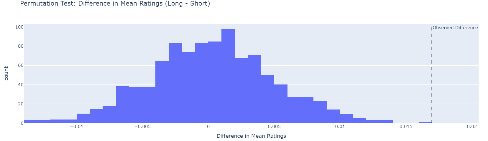
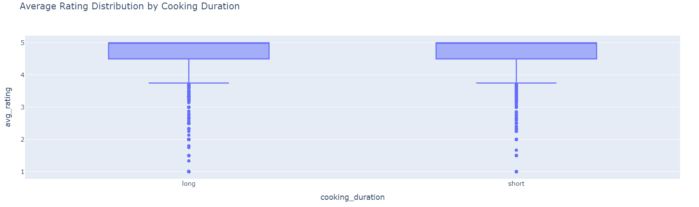

## Framing a Prediction Problem
**Prediction Task:** Predict the average rating of a recipe

**Type:** Regression problem (predicting a continuous value between 1-5)

**Response Variable:** avg_rating
- Represents the mean rating given to each recipe
- Scale: 1 to 5 stars

**Evaluation Metric:** Root Mean Square Error (RMSE)
- Chosen because:
  1. Same units as our predictions (stars)
  2. Penalizes larger errors more heavily
  3. Commonly used in rating prediction tasks

**Features Used for Prediction:**
- Recipe complexity indicators (minutes, n_steps)
- Recipe characteristics (n_ingredients)
- Nutritional information
- [Add other features used]

## Baseline Model
Our baseline model uses two key features:
1. minutes (numerical): Cooking time
2. calorie_quartile (categorical): Quartile categorization of calories

**Feature Processing:**
- Numerical features: Standardized using StandardScaler
- Categorical features: Encoded using OneHotEncoder

**Model Pipeline:**
1. ColumnTransformer for preprocessing both feature types
2. Linear Regression as the predictor
3. All steps implemented in a single sklearn Pipeline

**Performance:**
- RMSE: 0.6285
- This score represents our baseline for improvement

## Final Model

Our final model builds upon the baseline by incorporating both numerical and categorical features, with a focus on recipe characteristics that logically influence ratings.

### New Features Engineered
1. Cooking Categories:
  - Created meaningful time-based categories: 'quick_meal' (0-15 mins), 'standard_meal' (15-30 mins), 'elaborate_meal' (30-60 mins), and 'slow_cook' (>60 mins)
  - Rationale: Different cooking times may have different user expectations and rating patterns

2. Recipe Size Categories:
  - Categorized recipes into 'small', 'medium', and 'large' based on number of ingredients
  - Rationale: Recipe size might influence complexity and user satisfaction

3. Effort Level:
  - Combined steps and ingredients to create an effort score
  - Categorized into 'simple', 'moderate', and 'complex'
  - Rationale: The effort required might affect user ratings and satisfaction

### Model Implementation
- Used GradientBoostingRegressor, which showed better performance in initial testing
- Implemented a preprocessing pipeline including:
 * StandardScaler for numerical features
 * OneHotEncoder for categorical features
- Performed hyperparameter tuning using GridSearchCV with cross-validation

### Best Model Parameters
- n_estimators: 100
- learning_rate: 0.01
- max_depth: 3
- min_samples_leaf: 10

### Performance Metrics
- Final Model RMSE: 0.0.6284
- R² Score: 0.0001
- Improvement over baseline: 0.02%

### Feature Choice Rationale
Our engineered features were chosen based on culinary domain knowledge:
1. Time categories reflect common cooking duration breakpoints
2. Recipe size categories capture complexity through ingredient count
3. Effort level combines steps and ingredients to represent overall recipe difficulty

While the improvement over the baseline is modest, the model's features provide more interpretable insights into recipe characteristics that might influence ratings. The small improvement suggests that recipe ratings might be influenced more by subjective factors not captured in our current feature set.

## Fairness Analysis
Question: Does our model perform equally well for simple versus complex recipes?

Groups:
- Complex recipes (based on effort level)
- Simple recipes (based on effort level)

Results:
- RMSE for complex recipes: 0.6668
- RMSE for simple recipes: 0.6027
- Observed difference: 0.0640
- P-value: 0.0010

These results indicate that our model performs significantly differently between simple and complex recipes, raising fairness concerns that should be addressed in future iterations.

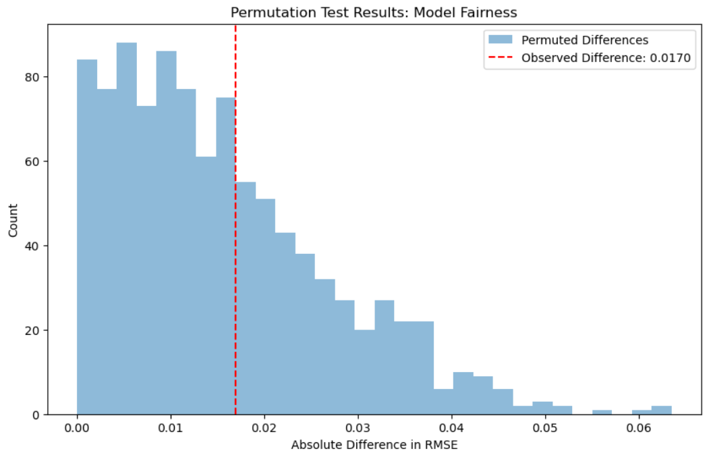